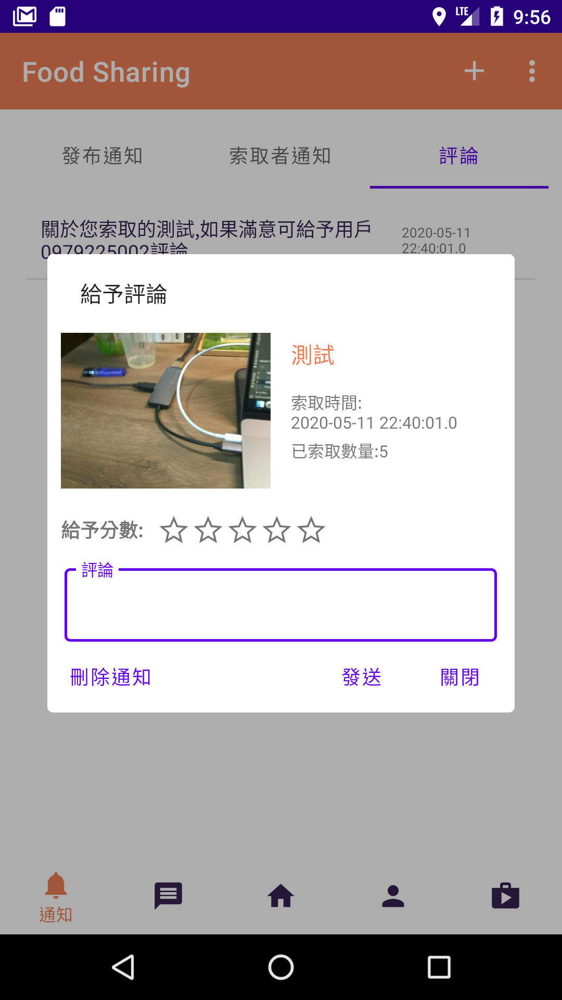
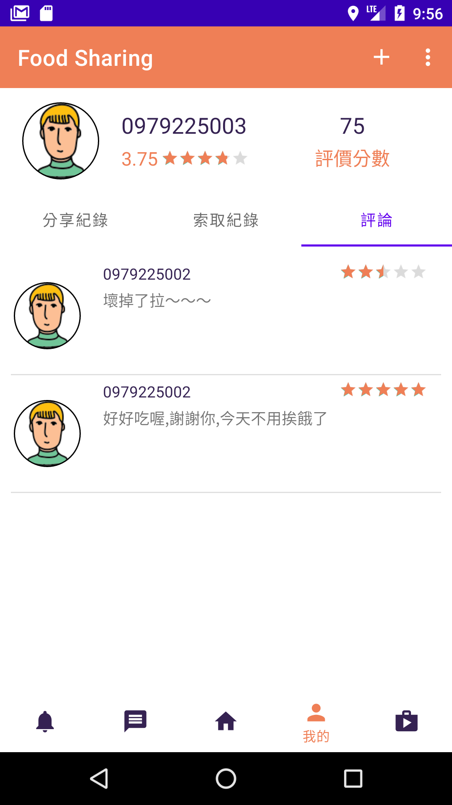

## 剩食終結者專案   

共同開發人員3員: 
   
[GitHub帳號:]
   
a0979225002,YichunChen49,floragoodjob
   

任務分配:
   
floragoodjob:資料庫設計
   
YichunChen49:UIUX,介面設計,專案介面美化,前端撰寫
   
a0979225002:後端撰寫,前端app功能實現
   
共通完成項目:專案頁面xml實現
   

開發環境android 23

擁有登入功能,註冊驗證,以firebase做推播功能,google map做地圖搜尋,與顯示當下位置
   
該有的邏輯都有判斷,如：註冊失敗五次鎖當下狀態,發布輸入判定,登出功能 等.....
   
後端使用java ee 的Maven做管理,Sql使用Mysql
   

2020/05/17
   
加入user個人評價分數

如有程式上問題,或想參觀交流,可聯繫我
我的信箱:a0979225002@gmail.com
